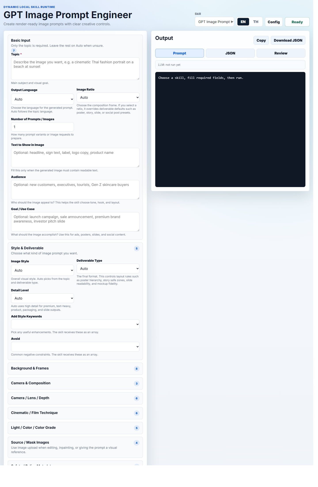

# Smart AI App

Smart AI App is a local, browser-based skill runner for AI prompt, content, storyboard, and planning workflows. It scans local skill folders, builds forms from each skill schema, and can run skills either through a bundled local runtime or through an OpenAI-compatible LLM provider configured from the browser UI.

The app is designed to stay simple to install and operate. It does not require a database. API keys are entered through the Config window in the browser and are stored only in that browser's local storage.

## Screenshot



## Features

- Dynamic skill discovery from the `skills/` folder.
- Automatic UI generation from each skill's `schemas/input.schema.json`.
- Optional enhanced UI layout from `schemas/ui.schema.json`.
- Automatic fallback fields when an input exists in `input.schema.json` but is missing from `ui.schema.json`.
- Multiple skill support through a skill selector in the browser.
- Local Python runtime support for skills that include `python/skill.py`.
- LLM runtime fallback for schema-only skills.
- OpenAI-compatible LLM calling through:
  - OpenRouter
  - NVIDIA NIM
- Browser-based API key configuration with masked password fields.
- Ordered LLM fallback chain from slot 1 to 4.
- Built-in LLM test tool that checks every configured fallback row and reports `OK`, `FAIL`, or `SKIP`.
- In-memory rate limiting for abnormal repeated calls.
- Thai and English UI language switching.
- JSON output export.
- Prompt-only output view for easier copying.
- Skill-specific post-processing for structured prompt/storyboard outputs.
- No database required.
- No direct config file editing required for end users.

## Project Structure

```text
Smart AI App/
  docs/
    images/
      smart-ai-app-gpt-image-prompt-engineer.png
  public/
    index.html
  skills/
    gpt-image-prompt-engineer/
    image_prompt_engineer/
    marketing-article-writer/
    household-product-reviewer/
    smart-landscape-designer/
    video-storyboard-to-prompts/
  server.js
  package.json
  package-lock.json
  .npmrc
  .env.example
```

Important files:

- `server.js`: local HTTP server, skill scanner, runtime dispatcher, LLM gateway, rate limiter.
- `public/index.html`: single-page browser UI.
- `skills/`: all installed skills live here.
- `schemas/input.schema.json`: required by every runnable skill folder.
- `schemas/ui.schema.json`: optional but recommended for a better form layout.
- `python/skill.py`: optional local runtime for a skill.

## Requirements

### Required

- Node.js 20 or newer
- npm
- A modern browser:
  - Chrome
  - Edge
  - Firefox
  - Safari

### Required For Local Python Skills

Some skills include a Python runtime at `python/skill.py`. To run those local runtimes, install:

- Python 3.10 or newer

If Python is not installed, schema-only skills can still run through a configured LLM provider.

### Optional

- Git, for cloning, version control, and pushing changes.
- GitHub CLI, if you want to manage authentication and repositories from the terminal.
- OpenRouter API key, for LLM runtime.
- NVIDIA NIM API key, for LLM runtime.

## Windows Installation

These steps assume Windows 10 or Windows 11.

### 1. Install Node.js

1. Open the official Node.js website:
   <https://nodejs.org/>
2. Download the LTS version.
3. Run the installer.
4. Keep the default options enabled, including npm.
5. Open a new PowerShell or Command Prompt window.
6. Verify installation:

```powershell
node --version
npm --version
```

Node should be version 20 or newer.

### 2. Install Python

1. Open:
   <https://www.python.org/downloads/windows/>
2. Download Python 3.10 or newer.
3. Run the installer.
4. Enable `Add python.exe to PATH`.
5. Complete the installation.
6. Open a new PowerShell window.
7. Verify:

```powershell
python --version
```

If `python` is not found, try:

```powershell
py --version
```

### 3. Install Git

1. Open:
   <https://git-scm.com/download/win>
2. Download Git for Windows.
3. Run the installer.
4. Default options are usually fine.
5. Verify:

```powershell
git --version
```

### 4. Clone Or Open The Project

If cloning from GitHub:

```powershell
cd "C:\Projects"
git clone https://github.com/pruksacharttk/Smart-AI-App
cd "Smart-AI-App"
```

If you already have the folder locally:

```powershell
cd "C:\Projects\Smart AI App"
```

### 5. Install npm Dependencies

This project currently uses only Node built-ins, but keep the lockfile installed so future dependencies are handled consistently:

```powershell
npm install
```

### 6. Run The App

```powershell
npm start
```

Open the browser:

```text
http://localhost:4173
```

If port `4173` is already in use:

```powershell
$env:PORT=4174
npm start
```

Then open:

```text
http://localhost:4174
```

## macOS Installation

These steps assume macOS 13 or newer.

### 1. Install Homebrew

If Homebrew is not installed, open Terminal and run the command from:

<https://brew.sh/>

Verify:

```bash
brew --version
```

### 2. Install Node.js

```bash
brew install node
```

Verify:

```bash
node --version
npm --version
```

Node should be version 20 or newer.

If your Homebrew Node version is older, install Node through `nvm`:

```bash
brew install nvm
mkdir -p ~/.nvm
```

Add the `nvm` initialization lines shown by Homebrew to your shell profile, then install Node 20 or newer:

```bash
nvm install 20
nvm use 20
```

### 3. Install Python

```bash
brew install python
python3 --version
```

### 4. Install Git

Git is often already installed on macOS. Verify:

```bash
git --version
```

If it is missing:

```bash
brew install git
```

### 5. Clone Or Open The Project

If cloning from GitHub:

```bash
cd ~/Projects
git clone https://github.com/pruksacharttk/Smart-AI-App
cd Smart-AI-App
```

If you already have the project folder:

```bash
cd "/path/to/Smart AI App"
```

### 6. Install npm Dependencies

```bash
npm install
```

### 7. Run The App

```bash
npm start
```

Open:

```text
http://localhost:4173
```

If port `4173` is already in use:

```bash
PORT=4174 npm start
```

Then open:

```text
http://localhost:4174
```

## Running The System

### Production-like Local Run

```bash
npm start
```

This runs:

```bash
node server.js
```

### Development Run

```bash
npm run dev
```

This uses Node's watch mode:

```bash
node --watch server.js
```

Use this when editing `server.js`. Browser-only edits in `public/index.html` usually only require a browser refresh.

### Environment Variables

The app can run without a `.env` file. Configuration is primarily done through the browser Config window.

Supported environment variables:

```text
PORT=4173
LLM_TIMEOUT_MS=35000
```

- `PORT`: local server port.
- `LLM_TIMEOUT_MS`: timeout per LLM fallback call in milliseconds.

The old OpenAI variables in `.env.example` are not required for the current OpenRouter/NVIDIA UI configuration flow.

## Browser Usage Guide

Open:

```text
http://localhost:4173
```

### 1. Choose A Skill

Use the `Skill` dropdown in the top-right area.

The dropdown is populated automatically from folders inside `skills/`.

### 2. Switch Language

Use the `EN` and `TH` buttons.

This changes the UI language. Some skill labels also depend on the skill's `ui.schema.json`.

### 3. Fill Required Inputs

Required fields are marked with `*`.

The form is generated from:

```text
skills/<skill-id>/schemas/input.schema.json
```

If a skill has:

```text
skills/<skill-id>/schemas/ui.schema.json
```

the UI uses it for section grouping, labels, descriptions, and layout.

### 4. Configure API Keys And LLM Fallback

Click `Config`.

You can configure:

- NVIDIA NIM API key
- NVIDIA base URL
- OpenRouter API key
- OpenRouter base URL
- Fallback model order 1 to 4
- Custom model names

API key fields are masked with password inputs. They are stored only in the browser's local storage.

No config file is created. No database is used.

### 5. Get Provider API Keys

OpenRouter:

```text
https://openrouter.ai/settings/keys
```

NVIDIA NIM:

```text
https://build.nvidia.com/settings/api-keys
```

Create an API key, copy it, and paste it into the Config window.

## OpenRouter Configuration Guide

OpenRouter provides access to many LLM providers through one OpenAI-compatible API. It is a good default provider for LLM-only skills and fallback models.

### 1. Create Or Sign In To An OpenRouter Account

1. Open <https://openrouter.ai/>.
2. Click `Sign In` or `Sign Up`.
3. Complete the login flow.

### 2. Create An API Key

1. Open <https://openrouter.ai/settings/keys>.
2. Click `Create Key`.
3. Use a descriptive name such as `Smart AI App Local`.
4. Create the key.
5. Copy the key immediately and keep it safe.

### 3. Add The Key To Smart AI App

1. Open Smart AI App in the browser.
2. Click `Config`.
3. Find the `OpenRouter` card.
4. Paste the API key into `API Key`.
5. Keep the Base URL as:

```text
https://openrouter.ai/api/v1
```

### 4. Choose OpenRouter Models

In the `Fallback order` area:

1. Choose `OpenRouter` as the provider.
2. Choose a model from the dropdown.
3. If a model is not listed, choose `Custom model`.
4. Type the exact model ID into `Custom model`.

Example OpenRouter model IDs:

```text
openrouter/free
nvidia/nemotron-3-super-120b-a12b:free
openai/gpt-oss-120b:free
deepseek/deepseek-v4-flash
```

Notes:

- Models ending in `:free` are usually free models.
- Paid models require OpenRouter credit or billing access.
- Model availability changes over time, so always test the model.

### 5. Test OpenRouter

1. Click `Test LLM`.
2. Read every fallback row.
3. `OK` means the provider, key, model, and base URL worked.
4. `FAIL` means the provider returned an error or timed out.
5. Move a working OpenRouter model to fallback row 1 if it should be the primary model.
6. Click `Save Config`.

### 6. Common OpenRouter Errors

- `HTTP 401`: API key is invalid or expired.
- `HTTP 403`: the account cannot access that model.
- `HTTP 404`: the model ID is wrong.
- `Timed out`: the provider or model is slow or unavailable.
- `LLM returned empty content`: the model returned no usable text.

## NVIDIA NIM Configuration Guide

NVIDIA NIM provides OpenAI-compatible model endpoints through NVIDIA's API platform. It can be used as a primary provider or as a fallback provider.

### 1. Create Or Sign In To An NVIDIA Account

1. Open <https://build.nvidia.com/>.
2. Sign in with an NVIDIA account.
3. Create an account if needed.

### 2. Create An API Key

1. Open <https://build.nvidia.com/settings/api-keys>.
2. Create a new API key.
3. Copy the key immediately and store it safely.

### 3. Add The Key To Smart AI App

1. Open Smart AI App in the browser.
2. Click `Config`.
3. Find the `NVIDIA NIM` card.
4. Paste the API key into `API Key`.
5. Keep the Base URL as:

```text
https://integrate.api.nvidia.com/v1
```

### 4. Choose NVIDIA Models

In the `Fallback order` area:

1. Choose `NVIDIA` as the provider.
2. Choose a model from the dropdown.
3. If a model is not listed, choose `Custom model`.
4. Type the exact NVIDIA model ID into `Custom model`.

Example NVIDIA model IDs:

```text
deepseek-ai/deepseek-v4-flash
openai/gpt-oss-120b
openai/gpt-oss-20b
deepseek-ai/deepseek-r1
```

Important:

- NVIDIA and OpenRouter may use different model IDs for similar models.
- Example: NVIDIA uses `deepseek-ai/deepseek-v4-flash`.
- OpenRouter uses `deepseek/deepseek-v4-flash`.
- If the model ID is wrong, the test usually returns `HTTP 404`.

### 5. Test NVIDIA

1. Click `Test LLM`.
2. Check every NVIDIA fallback row.
3. If a row is `OK`, that NVIDIA model is usable.
4. If a row fails, try another NVIDIA model or use OpenRouter as the first fallback.
5. Click `Save Config`.

### 6. Common NVIDIA Errors

- `HTTP 401`: API key is invalid.
- `HTTP 403`: the account cannot access that endpoint or model.
- `HTTP 404`: model ID or base URL is wrong.
- `Timed out`: the model is slow or unavailable.
- `LLM returned empty content`: the model returned no usable content.

## Recommended Fallback Setup

Start with provider rows that pass `Test LLM`.

Example:

```text
1. OpenRouter  -> nvidia/nemotron-3-super-120b-a12b:free
2. OpenRouter  -> openai/gpt-oss-120b:free
3. NVIDIA      -> deepseek-ai/deepseek-v4-flash
4. NVIDIA      -> openai/gpt-oss-20b
```

Use this only as a starting point. The best configuration depends on which provider account has access to which models.

### 6. Test LLM

Inside the Config window, click `Test LLM`.

The app tests every configured fallback row:

- `OK`: provider, key, URL, and model responded successfully.
- `FAIL`: provider responded with an error or timed out.
- `SKIP`: the row is incomplete, such as missing API key or model.

Move a working model to fallback row 1 for best performance.

### 7. Run Skill

Click `Run Skill`.

Execution behavior:

- If the selected skill has `python/skill.py` and no LLM config is available, the local Python runtime is used.
- If LLM config is available, the app uses the configured fallback models.
- If a model fails, the app tries the next fallback row.

### 8. Read Output

Output tabs:

- `Prompt`: the main user-facing result.
- `JSON`: full raw result for debugging or export.
- `Review`: coverage, validation, warnings, and status details.

### 9. Copy Or Download

Use:

- `Copy`: copies the active output.
- `Download JSON`: downloads the JSON output.

## Skill Management

## Adding A New Skill

Add a new folder under:

```text
skills/
```

Example:

```text
skills/my-new-skill/
```

Minimum required structure:

```text
skills/my-new-skill/
  skill.md
  schemas/
    input.schema.json
```

Recommended structure:

```text
skills/my-new-skill/
  skill.md
  schemas/
    input.schema.json
    ui.schema.json
    output.schema.json
  python/
    skill.py
  prompts/
    system.prompt.md
    task.prompt.md
  knowledge/
    notes.md
```

### Required File: input.schema.json

Every skill must include:

```text
schemas/input.schema.json
```

The app scans only folders that contain this file.

The schema should be valid JSON Schema and should include:

- `type: "object"`
- `properties`
- optional `required`
- optional defaults
- enums where useful

Example:

```json
{
  "title": "Example Skill Input",
  "type": "object",
  "required": ["topic"],
  "properties": {
    "topic": {
      "type": "string",
      "title": "Topic",
      "description": "What should the skill create?"
    },
    "language": {
      "type": "string",
      "enum": ["en", "th"],
      "default": "en"
    }
  }
}
```

### Optional File: ui.schema.json

Use `ui.schema.json` to control form layout, labels, descriptions, sections, and Thai/English text.

If this file is incomplete, the app adds missing fields from `input.schema.json` into an extra schema section automatically.

### Optional File: output.schema.json

Use `output.schema.json` to document expected output.

Future adapters can use this file to improve automatic output rendering.

### Optional Runtime: python/skill.py

If a skill includes:

```text
python/skill.py
```

the app can run it locally.

The Python script should:

1. Read JSON from stdin.
2. Expect an envelope like:

```json
{
  "params": {
    "topic": "example"
  }
}
```

3. Print JSON to stdout.
4. Return a non-zero exit code on failure.

Example output:

```json
{
  "success": true,
  "output": {
    "prompt": "Final prompt text"
  },
  "warnings": []
}
```

### LLM-only Skill

If a skill has no `python/skill.py`, it can still run through the LLM gateway when the user has configured OpenRouter or NVIDIA in the Config window.

For best results, make `skill.md` clear and explicit:

- what the skill does
- expected output format
- language rules
- safety or quality rules
- examples of good output

### Auto Discovery

The server scans:

```text
skills/*
```

Any folder with:

```text
schemas/input.schema.json
```

is listed as a skill.

The browser refreshes the skill list periodically. A manual browser refresh will also reload the list.

## Editing Existing Skills

To edit a skill:

1. Open its folder under `skills/`.
2. Update `skill.md` for behavior and instructions.
3. Update `schemas/input.schema.json` when adding or changing inputs.
4. Update `schemas/ui.schema.json` when changing the UI layout.
5. Update `schemas/output.schema.json` when changing the expected output shape.
6. If the skill has local runtime logic, update `python/skill.py`.
7. Refresh the browser.
8. Run the skill and check the `Prompt`, `JSON`, and `Review` tabs.

## Rate Limiting

The server has in-memory rate limits:

- `/api/run-skill`: 12 calls per minute.
- `/api/test-llm`: 8 calls per minute.

If a limit is exceeded, the server returns:

```text
Rate limit exceeded. Try again in ...s.
```

This protects local provider keys from accidental rapid repeated calls.

## Troubleshooting

### npm says "No workspaces found"

This project includes `.npmrc` with:

```text
workspaces=false
```

Run npm commands from the project folder:

```bash
cd "C:\Projects\Smart AI App"
npm install
npm start
```

### Browser cannot open localhost

Check that the server is running:

```bash
npm start
```

Confirm the port:

```text
http://localhost:4173
```

If another app uses the port, choose another port:

```bash
PORT=4174 npm start
```

On Windows PowerShell:

```powershell
$env:PORT=4174
npm start
```

### LLM Test Fails

Use `Config > Test LLM`.

Common errors:

- `HTTP 401`: API key is invalid.
- `HTTP 403`: account has no permission for that model.
- `HTTP 404`: model ID or base URL is wrong.
- `Timed out`: provider/model is slow or unavailable.
- `LLM returned empty content`: model returned no usable text.

Move working models to the top fallback rows.

### Skill Does Not Appear

Check that the folder has:

```text
skills/<skill-id>/schemas/input.schema.json
```

Also verify the JSON file is valid.

### Thai Text Looks Broken

Make sure files are saved as UTF-8.

The server sets Python subprocess encoding to UTF-8 for local Python skills.

### Python Skill Fails

Run the server from a terminal so errors are visible:

```bash
npm start
```

Then run the skill in the browser and check the terminal output.

Also confirm:

```bash
python --version
```

or on macOS:

```bash
python3 --version
```

## Development Notes

- The app intentionally keeps the UI in a single HTML file for portability.
- The server uses Node built-in modules and does not require Express.
- API keys are not written to project files.
- Config is stored in browser local storage.
- Skill folders should be treated as portable packages.

